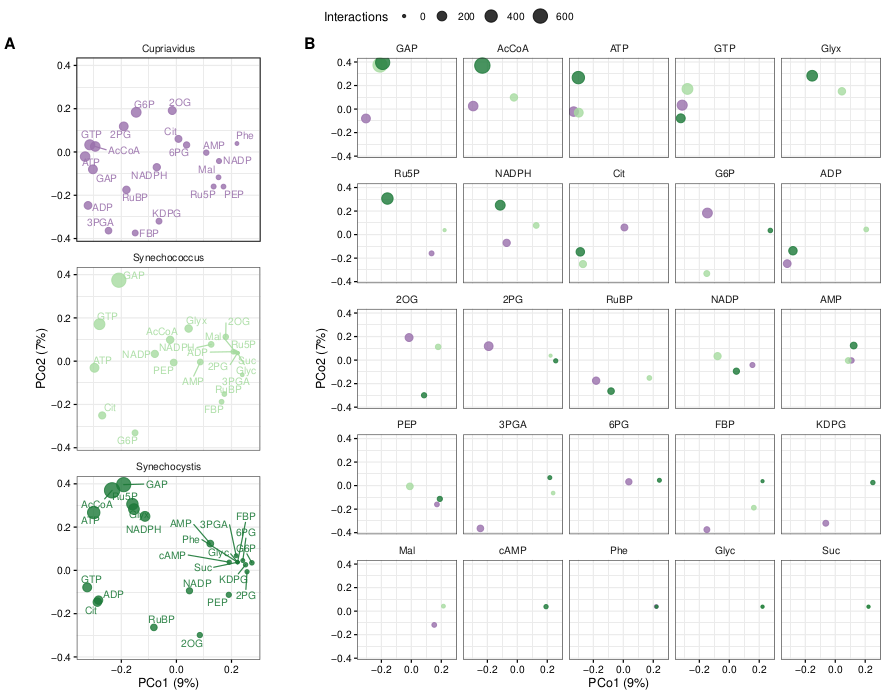
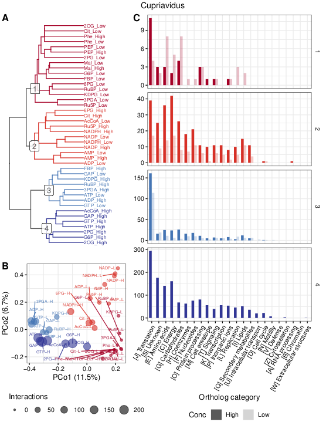
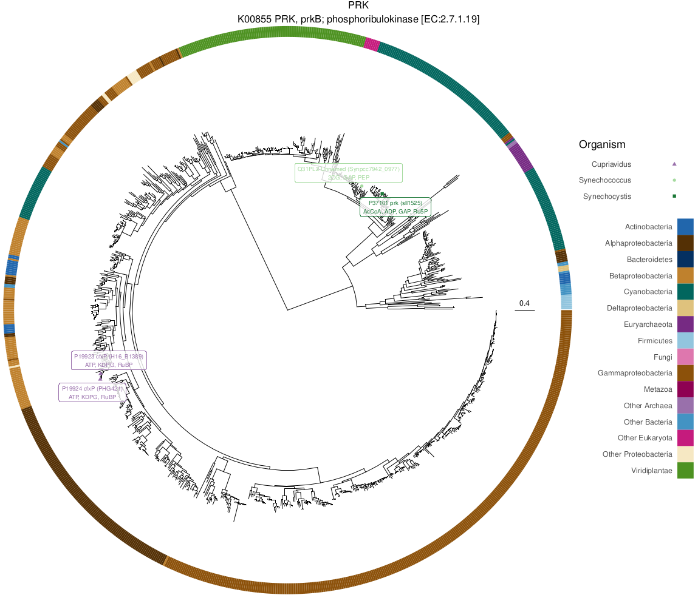

# LiP-SMap data analysis

Analysis of [limited proteolysis small molecule mapping (LiP-SMap)](https://www.cell.com/cell/fulltext/S0092-8674(17)31448-4) data.

### Contents

**1. [Data preparation](#prep)**

**2. [Interaction with enzymes](#enzymes)**

**3. [Functional categories](#functions)**

**4. [Comparison of orthologs](#orthologs)**

**5. [Comparison of KEGG modules](#modules)**

**6. [Phylogenetic analysis](#phylogenetics)**

**A. [Author](#author)**

<a name="prep"></a>
## 1. Data preparation

### Concatenation

Data were concatenated from the original source:
```
source/concatenate_input_data.R
```

In the process, this file was created, indicating missing loci:
```
data/missing_locus_uniprot_IDs.txt
```

The missing loci were downloaded using BASH:
```
source/get_missing_loci.sh
```

...and added to the results in the R script through this file generated by the BASH script:
```
data/uniprot_locus.tab
```

The R script finally produced concatenated LiP-SMap results:
```
data/annotated_comparison_results.tab.gz
```

### Additional annotations

Additional annotations were downloaded from KEGG:
```
source/get_ko_and_modules.sh
```

...providing these annotation files:
```
data/KEGGgene_uniprot_organism.tab
data/KEGGgene_KO_organism.tab
data/KEGGgene_module_organism.tab
data/module_description.tab
data/module_compound.tab
data/module_reaction.tab
data/reaction_compound.tab
```

<a name="enzymes"></a>
## 2. Interactions with enzymes

Metabolite interactions with enzymes and non-enzymes were compared using Fisher's exact test:
```
source/enzymes.R
```

...yielding the following results:
```
results/Fisher_exact_test_for_enzyme_interactions.tab
```

<a name="functions"></a>
## 3. Functional categories

Proteins were grouped by various functional categories (EC, GO, KEGG module, pathway) and tested for enrichment of interactions:

```
source/functions.R
```

...yielding the following results:
```
results/Fisher_exact_test_for_EC_interactions.tab
results/Fisher_exact_test_for_GO_interactions.tab
results/Fisher_exact_test_for_module_interactions.tab
results/Fisher_exact_test_for_pathway_interactions.tab
```

<a name="orthologs"></a>
## 4. Comparison of orthologs

Orthologs in the organisms were identified via UniProt and the eggNOG labels:
```
source/identify_orthologs.sh
```

...resulting in these data files:
```
data/uniprot_eggNOG.tab
data/organism_uniprot.tab
```

The second file lists all UniProt sequences in the organisms, so that those without an ortholog could be accounted for as well.

Annotations for the eggNOG labels were acquired:
```
source/get_eggNOG_categories.sh
```

...and filtered with R:
```
source/filter_eggNOG_annotations.R
```

...thus producing the final eggNOG ortholog annotations:
```
data/eggNOG_annotations.tab
```

Interaction patterns with orthologs were then compared within and between organisms:
```
source/orthologs.R
```

...producing a range of comparison plots and tables:
```
results/orthologs_interaction_comparison.png
results/orthologs_interaction_pcoa.pdf
results/Fig.orthologs_interaction_pcoa.pdf
results/orthologs_interaction_jaccard.tab
results/orthologs_interaction_pca.pdf
results/orthologs_interaction_clustering.pdf
results/metabolite_function_interactions.pdf
results/ortholog_clustering.Cupriavidus_by_Metabolite.pdf
results/ortholog_clustering.Cupriavidus_by_Ortholog.pdf
results/ortholog_clustering.Synechococcus_by_Metabolite.pdf
results/ortholog_clustering.Synechococcus_by_Ortholog.pdf
results/ortholog_clustering.Synechocystis_by_Metabolite.pdf
results/ortholog_clustering.Synechocystis_by_Ortholog.pdf
results/ortholog_category_heatmap.pdf
```

**Example 1:** Ortholog metabolite interaction PCoA



**Example 2:** Ortholog metabolite interaction clustering in _Cupriavidus_



<a name="modules"></a>
## 5. Comparison of KEGG modules

KEGG modules are groups of enzymes constituting complete or partial pathways. Proteins were grouped by these modules and interactions were summarized and compared:
```
source/modules.R
```

...yielding the following results:
```
results/module_interaction_summary.tab
results/module_interactions.pdf
```

**Example:** KEGG module metabolite interactions (top modules by number of interactions)

")

<a name="phylogenetics"></a>
## 6. Phylogenetic analysis

A phylogenetic analysis was performed on Calvin cycle enzymes from the corresponding KEGG module ([M00165](https://www.genome.jp/kegg-bin/show_module?M00165)). Sequences were downloaded from UniProt, filtered with CD-HIT, aligned with MAFFT, and used to make trees with FastTreeMP:
```
source/Calvin_cycle_phylogenetics.sh
```

The NCBI taxonomy was consulted to give organism labels to all proteins in the tree using the following helper script:
```
source/taxid-to-taxonomy.py
```

UniProt sequences were acquired based on KEGG orthologs using the following helper script:
```
source/uniprot_sequences_from_KO.sh
```

Additionally, gene identifiers were downloaded for the LiP-SMap organism proteins:
```
source/get_uniprot_gene_identifiers.sh
```

Finally, the trees were plotted using _phytools_ and _ggtree_ in R:
```
source/phylogenetics.R
```

...producing the following final PDF containing visualizations of all trees:
```
results/cbb_ko_trees.pdf
```

**Example:** PRK phylogenetic tree with LiP-SMap interactions



<a name="author"></a>
## A. Author
Johannes Asplund-Samuelsson, KTH (johannes.asplund.samuelsson@scilifelab.se)
