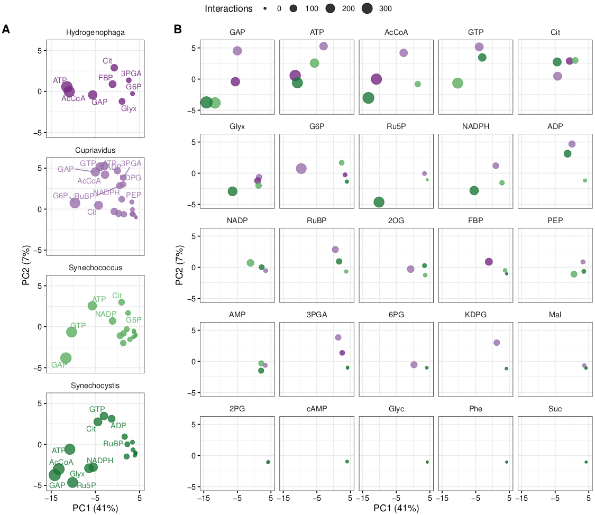
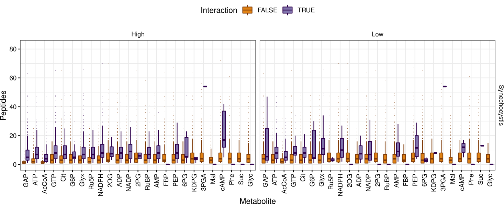
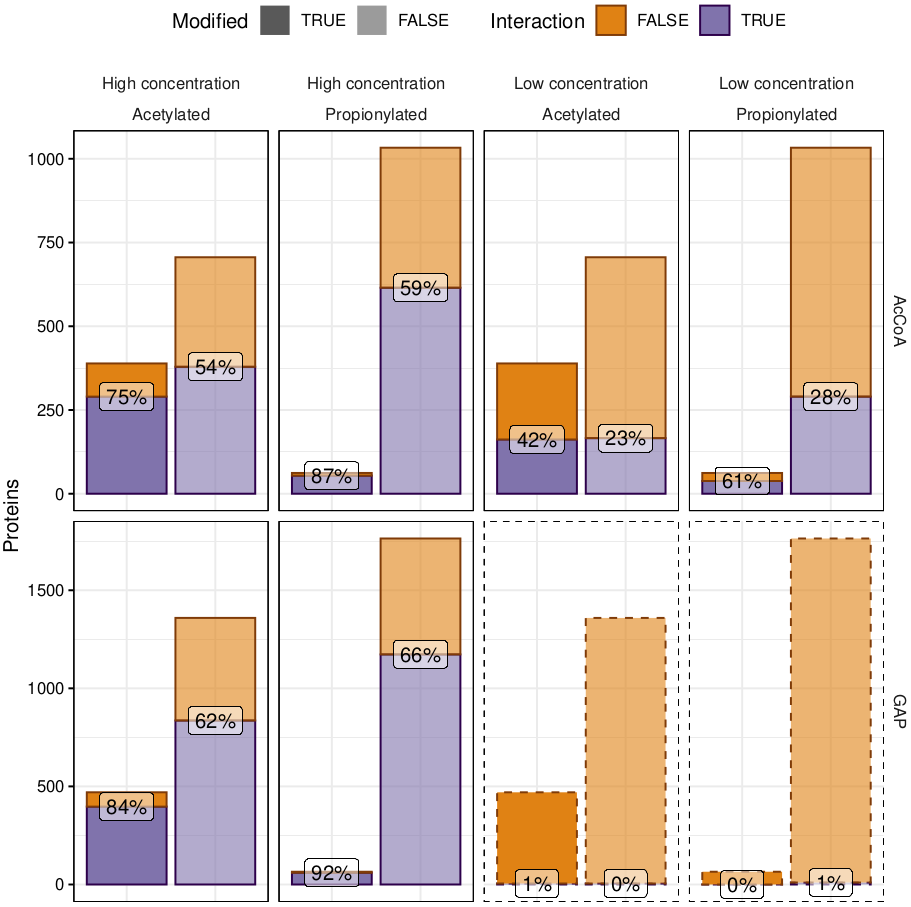
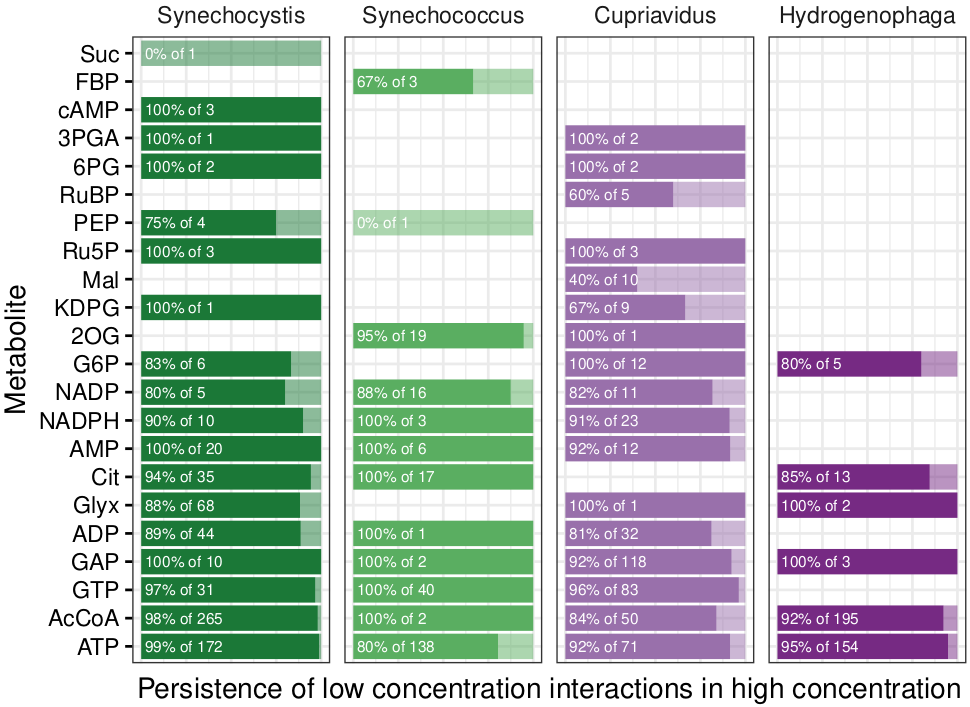
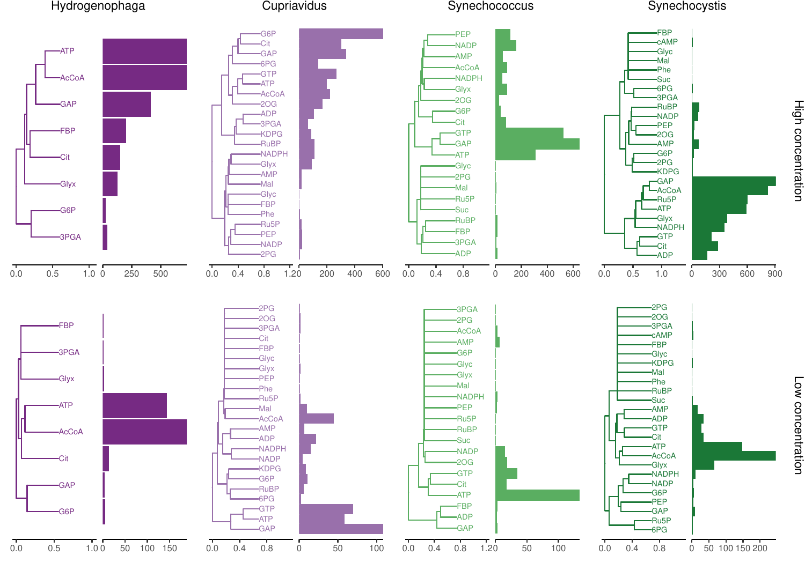
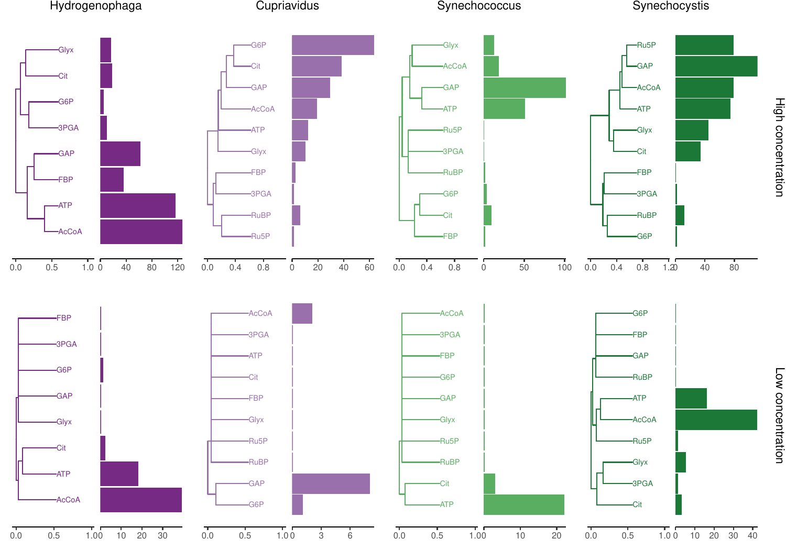

# LiP-SMap data analysis

Analysis of [limited proteolysis small molecule mapping (LiP-SMap)](https://www.cell.com/cell/fulltext/S0092-8674(17)31448-4) data.

### Contents

1. [Data preparation](#prep)
   1. [Concatenation](#cat)
   2. [Additional annotations](#annotations)
   3. [Phylogenetic analysis](#phylogenetics)
   4. [Repeated experiments](#rep)
   5. [Reduced dataset for tutorial](#reddata)
2. [Analysis pipeline: Step-by-step](#analysis)
   1. [Interaction with enzymes](#enzymes)
   2. [Functional categories](#functions)
   3. [Comparison of orthologs](#orthologs)
   4. [Comparison of KEGG modules](#modules)
   5. [Phylogenetic trees](#trees)
   6. [Supplementary tables](#tables)
   7. [Calvin cycle and sinks](#calvin)
   8. [Carbon concentration mechanisms](#ccm)
   9. [Number of detected peptides](#peptides)
   10. [Post-translational modifications](#mod)
   11. [Quality control](#qc)
   12. [Metabolite interactions clustering](#metabolites)
3. [Tutorial: Quick start](#tutorial)
   1. [Install and enter the lipsmap repository](#install)
   2. [Concatenate the data](#tutcat)
   3. [Run the analysis pipeline](#tutrun)
4. [Requirements](#req)
5. [Author](#author)

<a name="prep"></a>
## 1. Data preparation

Data were prepared for analysis by concatenating input files, by gathering annotations for the organisms in question, and by performing a phylogenetic analysis. These data preparation steps were less prone to changes and updates compared to the analysis pipeline, and were therefore held separate.

<a name="cat"></a>
### 1.1. Concatenation

Data were concatenated from the original source:
```
Rscript source/concatenate_input_data.R ${INDIR} ${OUTFILE}
```

Missing loci were amended by the concatenation R script with the intermediate files `intermediate/missing_locus_uniprot_IDs.txt` and `intermediate/uniprot_locus_missing.tab`.

The R script finally produced concatenated LiP-SMap in `OUTFILE`.

<a name="annotations"></a>
### 1.2. Additional annotations

#### KEGG annotations

Additional annotations were downloaded from KEGG:
```
source/get_ko_and_modules.sh
```

...providing these annotation files:
```
data/KEGGgene_uniprot_organism.tab
data/KEGGgene_KO_organism.tab
data/KEGGgene_module_organism.tab
data/KEGGgene_EC_organism.tab
data/EC_description.tab
data/module_description.tab
data/module_compound.tab
data/module_reaction.tab
data/reaction_compound.tab
```

#### eggNOG ortholog annotations

Orthologs in the organisms were identified via UniProt and the eggNOG labels:
```
source/identify_orthologs.sh
```

...resulting in these data files:
```
data/uniprot_eggNOG.tab
data/organism_uniprot.tab
```

The second file lists all UniProt sequences in the organisms, so that those without an ortholog could be accounted for as well.

Annotations for the eggNOG labels were acquired:
```
source/get_eggNOG_categories.sh
```

...and filtered with R:
```
source/filter_eggNOG_annotations.R
```

...thus producing the final eggNOG ortholog annotations:
```
data/eggNOG_annotations.tab
```

#### Gene identifiers

Gene identifiers were downloaded for the LiP-SMap organism proteins:
```
source/get_uniprot_gene_identifiers.sh
```

...producing these lists:
```
data/uniprot_gene.tab
data/uniprot_locus_complete.tab
```

<a name="phylogenetics"></a>
### 1.3. Phylogenetic analysis

A phylogenetic analysis was performed on Calvin cycle enzymes from the corresponding KEGG module ([M00165](https://www.genome.jp/kegg-bin/show_module?M00165)), supplemented with transaldolase (K00616, K13810), triose-phosphate isomerase (K01803), and ribulose-phosphate epimerase (K01783). Sequences were downloaded from UniProt, filtered with CD-HIT, aligned with MAFFT, and used to make trees with FastTreeMP:
```
source/Calvin_cycle_phylogenetics.sh
```

Within the phylogenetic analysis script, the NCBI taxonomy was consulted to give organism labels to all proteins in the tree using the helper script `source/taxid-to-taxonomy.py`. Furthermore, UniProt sequences were acquired based on KEGG orthologs using the helper script `source/uniprot_sequences_from_KO.sh`.

<a name="rep"></a>
### 1.4. Repeated experiments

Assessment of minimum _q_ value correlation and agreement on significant interactions between repeated experiments was performed with this script:
```
source/dates.R
```

...yielding the following plots:
```
results/dates_min_q_cor.pdf
results/dates_agreement.pdf
```

<a name="reddata"></a>
### 1.5. Reduced dataset for tutorial

A reduced dataset was prepared from the original source to be used in the [tutorial](#tutorial). The reduced tutorial dataset consists of a subset of metabolites measured in most organisms, and a subset of 250 randomly selected proteins per organism. The proteins were selected to overlap in terms of ortholog groups in order to permit some of the analysis steps.

This script was used to subset the data from the original source:

```
source/tutorial_data.R
```

The tutorial dataset mimics the file names and directory structure of the original data and is thereby divided into one folder per organism, with one file per experiment (including repeated experiments), for example this file:

```
data/tutorial/lipsmap/Cupriavidus/comparisonResult_3PGA_7_grouped_annot_20200914.csv
```

<a name="analysis"></a>
## 2. Analysis pipeline: Step-by-step

A series of R scripts were used to test hypotheses, and to generate data visualizations and tables. All scripts can be run in order by invoking the analysis shell script:
```
./analysis.sh ${INFILE} ${OUTDIR}
```

...where `INFILE` is an output file from `source/concatenate_input_data.R`, and `OUTDIR` is a desired output directory, in which each script will have its own output subdirectory.

Standard output ("`stdout`") and standard error ("`stderr`") reporting from the scripts is logged in this file:
```
${OUTDIR}/analysis.log
```

The individual steps of the analysis are described below.

<a name="enzymes"></a>
### 2.1. Interactions with enzymes

Metabolite interactions with enzymes and non-enzymes were compared using Fisher's exact test:
```
Rscript source/enzymes.R ${INFILE} ${OUTDIR}/enzymes
```

...yielding the following results:
```
Fisher_exact_test_for_enzyme_interactions.tab
```

<a name="functions"></a>
### 2.2. Functional categories

Proteins were grouped by various functional categories (EC, GO, KEGG module, pathway) and tested for enrichment of interactions:
```
Rscript source/functions.R ${INFILE} ${OUTDIR}/functions
```

...yielding the following results:
```
Fisher_exact_test_for_EC_interactions.tab
Fisher_exact_test_for_GO_interactions.tab
Fisher_exact_test_for_module_interactions.tab
Fisher_exact_test_for_pathway_interactions.tab
```

<a name="orthologs"></a>
### 2.3. Comparison of orthologs

Interaction patterns with orthologs were compared within and between organisms:
```
Rscript source/orthologs.R ${INFILE} ${OUTDIR}/orthologs
```

...producing a range of comparison plots and tables.

Overview and clustering of orthologs across the whole dataset:
```
orthologs_interaction_comparison.png
orthologs_interaction_clustering.pdf
metabolite_function_interactions.pdf
```

PCA analysis at high ([Fig 1](#fig1)) and low concentration:
```
Fig.orthologs_interaction_pca.high.pdf
Fig.orthologs_interaction_pca.low.pdf
orthologs_interaction_pca.high.pdf
orthologs_interaction_pca.low.pdf
```

Clustering of metabolites or orthologs per organism ([Fig 2](#fig2)):
```
ortholog_clustering.Cupriavidus_by_Metabolite.pdf
ortholog_clustering.Cupriavidus_by_Ortholog.pdf
ortholog_clustering.Hydrogenophaga_by_Metabolite.pdf
ortholog_clustering.Hydrogenophaga_by_Ortholog.pdf
ortholog_clustering.Synechococcus_by_Metabolite.pdf
ortholog_clustering.Synechococcus_by_Ortholog.pdf
ortholog_clustering.Synechocystis_by_Metabolite.pdf
ortholog_clustering.Synechocystis_by_Ortholog.pdf
```

Clustered heatmap of interactions between metabolites and ortholog categories:
```
ortholog_category_heatmap.abs.pdf
ortholog_category_heatmap.norm.pdf
```

<a name="fig1"></a>

|  |
| --- |
| **Fig 1.** Ortholog metabolite interaction PCA, high concentration. |

<a name="fig2"></a>

|  |
| --- |
| **Fig 2.** Ortholog metabolite interaction clustering in _Cupriavidus_. |

<a name="modules"></a>
### 2.4. Comparison of KEGG modules

KEGG modules are groups of enzymes constituting complete or partial pathways. Proteins were grouped by these modules and interactions were summarized and compared:
```
Rscript source/modules.R ${INFILE} ${OUTDIR}/modules
```

...yielding the following results:
```
module_interaction_summary.tab
module_interactions.pdf
```

The overlap of modules and ortholog categories was examined:
```
Rscript source/category_module_overlap.R
```

...producing the following plot ([Fig 3](#fig3)):
```
results/category_module_overlap.pdf
```

<a name="fig3"></a>

| ") |
| --- |
| **Fig 3.** KEGG module metabolite interactions (top modules by number of interactions). |


<a name="trees"></a>
### 2.5. Phylogenetic trees

Phylogenetic trees of Calvin cycle genes were plotted using _phytools_ and _ggtree_ in R:
```
Rscript source/phylogenetics.R ${INFILE} ${OUTDIR}/phylogenetics
```

...producing the following final PDF containing visualizations of all trees, highlighting interactions with metabolites ([Fig 4](#fig4)):
```
cbb_ko_trees.pdf
```

<a name="fig4"></a>


|  |
| --- |
| **Fig 4.** PRK phylogenetic tree with LiP-SMap interactions. |

<a name="tables"></a>
### 2.6. Supplementary tables

KEGG EC and module annotations were combined with eggNOG orthologs and categories to give context to metabolite-protein interactions for low and high concentration:
```
Rscript source/tables.R ${INFILE} ${OUTDIR}/tables
```

...yielding a long format supplementary table:
```
ortholog_ec_module_interactions.xlsx
```

<a name="calvin"></a>
### 2.7. Calvin cycle and sinks

Calvin (CBB) cycle enzymes and related sink (or "drain") enzymes were investigated for interactions with the tested metabolites:
```
Rscript source/cbb.R ${INFILE} ${OUTDIR}/cbb
```

...by creating a plot of all interactions:
```
cbb.pdf
```

...with enzymes defined by EC number annotations from KEGG in the files `data/cbb_enzymes.tab` and `data/cbb_drains.tab`.

<a name="ccm"></a>
### 2.8. Carbon concentration mechanisms

Carbon concentration mechanism (CCM) interactions in _Synechocystis_ were plotted using this script:
```
Rscript source/ccm.R ${INFILE} ${OUTDIR}/ccm
```

...generating this output:
```
ccm.pdf
```

...based on CCM and regulatory genes listed in `data/CCM_regulatory_proteins.csv`.

<a name="peptides"></a>
### 2.9. Number of detected peptides

The number of detected peptides for proteins where none (Interaction FALSE) or at least one peptide (Interaction TRUE) showed significant interaction with a metabolite was plotted for each organism and concentration:
```
Rscript source/peptides.R ${INFILE} ${OUTDIR}/peptides
```

...yielding this graphic ([Fig 5](#fig5)):
```
peptides_per_protein.pdf
```

Furthermore, the script counted the number of detected peptides in each experiment:
```
peptides_per_experiment.pdf
```

<a name="fig5"></a>

|  |
| --- |
| **Fig 5.** Detected peptides per protein compared to occurrence of interaction in _Synechocystis_. |

<a name="mod"></a>
### 2.10. Post-translational modifications

Interactions between _Synechocystis_ proteins and acetyl-CoA or GAP were compared to published [acetylome](https://pubs.acs.org/doi/10.1021/pr501275a) and [propionylome](https://www.mdpi.com/1422-0067/20/19/4792/html) data using Fisher's exact test followed by plotting:
```
Rscript source/modifications.R ${INFILE} ${OUTDIR}/modifications
```

...with this plot as the result ([Fig 6](#fig6)):
```
modifications.pdf
```

<a name="fig6"></a>

|  |
| --- |
| **Fig 6.** Overlap between post-translational modifications and interactions with acetyl-CoA or GAP in _Synechocystis_ (dashed lines indicate insignificant enrichment). |

<a name="qc"></a>
### 2.11. Quality control

Quality of the experiments was assessed by checking persistence of significant low concentration interactions in high concentration ([Fig 7](#fig7)), as well as correlating peptide fold changes in low and high concentration:
```
Rscript source/qc.R ${INFILE} ${OUTDIR}/qc
```

...which resulted in the following visualizations:
```
persistence.pdf
fc_correlation.png
```

<a name="fig7"></a>

|  |
| --- |
| **Fig 7.** Fraction interactions that persist from low to high concentration. |

<a name="metabolites"></a>
### 2.12. Metabolite interactions clustering

Metabolite-protein interaction patterns were compared within organisms with PCA and Jaccard distance/Ward.D2 hierarchical clustering using only proteins that were detected in all experiments. This is different from the [ortholog interactions clustering](#orthologs) since it is based on all detected proteins in each organism and not only orthologs found in all organisms. The analysis in this step was invoked as such:

```
Rscript source/metabolites.R ${INFILE} ${OUTDIR}/metabolites
```

...and yielded a PCA plot and a hierarchical clustering plot ([Fig 8](#fig8)):

```
metabolites_pca.pdf
metabolites_jaccard_ward_D2.pdf
```

<a name="fig8"></a>

|  |
| --- |
| **Fig 8.** Clustering of metabolite-protein interaction patterns. Bars show number of proteins interacting with each metabolite. |

<a name="tutorial"></a>
## 3. Tutorial: Quick start

This tutorial demonstrates how to concatenate data from the original source structure and then run all analysis scripts on those data. The [example data](#reddata) used here are a subset of the full dataset containing fewer metabolites and a random subset of 250 proteins per organism. It is therefore not representative of the full dataset.

**Important:** Before starting, make sure that the [requirements](#req) are met. For running only the tutorial or the analysis pipeline it is enough to meet the R, Bash, and GNU parallel requirements.

<a name="install"></a>
### 3.1. Install and enter the lipsmap repository

The lipsmap repository should be installed on the target computer like so:
```
git clone https://github.com/Asplund-Samuelsson/lipsmap
```

The installation takes approximately five seconds, depending on the speed of the internet connection. After it finishes, change directory into the lipsmap repository:
```
cd lipsmap
```

<a name="tutcat"></a>
### 3.2. Concatenate the data

The first step is to [concatenate the input data](#cat) from multiple LiP-SMap experiments in different organisms. Note that the pipeline described in this repository is specifically written to accommodate _Hydrogenophaga_, _Cupriavidus_, _Synechococcus_, and _Synechocystis_, and would require modification to accept other organisms.

The input data comes in multiple files:
```
data/tutorial/lipsmap/Cupriavidus/comparisonResult_3PGA_7_grouped_annot_20200914.csv
...
data/tutorial/lipsmap/Cupriavidus/comparisonResult_RuBP_7_grouped_annot_20200914.csv

data/tutorial/lipsmap/Hydrogenophaga/comparisonResult_3PGA_16_grouped_annot_20210527.csv
...
data/tutorial/lipsmap/Hydrogenophaga/comparisonResult_Glyx_17_grouped_annot_20210603.csv

data/tutorial/lipsmap/Synechococcus/comparisonResult_3PGA_13_grouped_annot_20210219.csv
...
data/tutorial/lipsmap/Synechococcus/comparisonResult_RuBP_14_grouped_annot_20210329.csv

data/tutorial/lipsmap/Synechocystis/comparisonResult_3PGA_13_grouped_annot_20210219.csv
...
data/tutorial/lipsmap/Synechocystis/comparisonResult_RuBP_11_grouped_annot_20210113.csv
```

We concatenate the files and make some corrections to locus IDs with an R script:
```
Rscript source/concatenate_input_data.R data/tutorial/lipsmap data/tutorial/lipsmap.tab.gz
```

Thereby we get the following compressed data file to be used with the analysis pipeline:
```
data/tutorial/lipsmap.tab.gz
```

**Important:** The concatenated data contains only the latest experiment, as defined by the date in the file names. If an earlier experiment is desired, one must remove the more recent file from the input directory. Another option is to set up a new input directory and populate it with symbolic links to the desired input files.

<a name="tutrun"></a>
### 3.3. Run the analysis pipeline

The [analysis pipeline](#analysis) consists of many independent steps carried out by individual R scripts stored in the `source` directory. For convenience, a Bash script is set up to run all the steps automatically from a single command:

```
./analysis.sh data/tutorial/lipsmap.tab.gz results/tutorial
```

The pipeline finishes in less than two minutes, depending on the performance of the computer.

Messages from the individual pipeline scripts, for example errors, are stored in a log file:
```
results/tutorial/analysis.log
```

The analysis pipeline stores the results in one subdirectory per script:
```
results/tutorial/cbb/
results/tutorial/ccm/
results/tutorial/enzymes/
results/tutorial/functions/
results/tutorial/metabolites/
results/tutorial/modifications/
results/tutorial/modules/
results/tutorial/orthologs/
results/tutorial/peptides/
results/tutorial/phylogenetics/
results/tutorial/qc/
results/tutorial/tables/
```

The tutorial output is available in this repository to demonstrate what it should look like. One example is to compare the hierarchical clustering of a complete dataset ([Fig 8](#fig8)) and the reduced tutorial dataset ([Fig 9](#fig9)).

<a name="fig9"></a>

|  |
| --- |
| **Fig 9.** Clustering of metabolite-protein interaction patterns in the tutorial dataset. Bars show number of proteins interacting with each metabolite. |

<a name="req"></a>
## 4. Requirements

This analysis has been tested on a **12-core 32 GB RAM Linux system with Ubuntu 20.04 LTS** and the following software:

| Program | Version | Libraries | |
| --- | --- | --- | --- |
| Bash | 5.0.17 | | \* |
| R | 4.1.1 | ape, doMC, foreach, ggpubr, ggrepel, ggtree, openxlsx, phytools, scales, tidyverse, vegan | \* |
| Python | 3.7.6 | Biopython | |
| CD-HIT | 4.8.1 | | |
| seqmagick | 0.8.0 | | |
| MAFFT | 7.453 | | |
| FastTree | 2.1.11 | | |
| GNU parallel | 20161222 | | \* |

\*Required for concatenating data and running the analysis pipeline.

<a name="author"></a>
## 5. Author
Johannes Asplund-Samuelsson, KTH (johannes.asplund.samuelsson@scilifelab.se)
